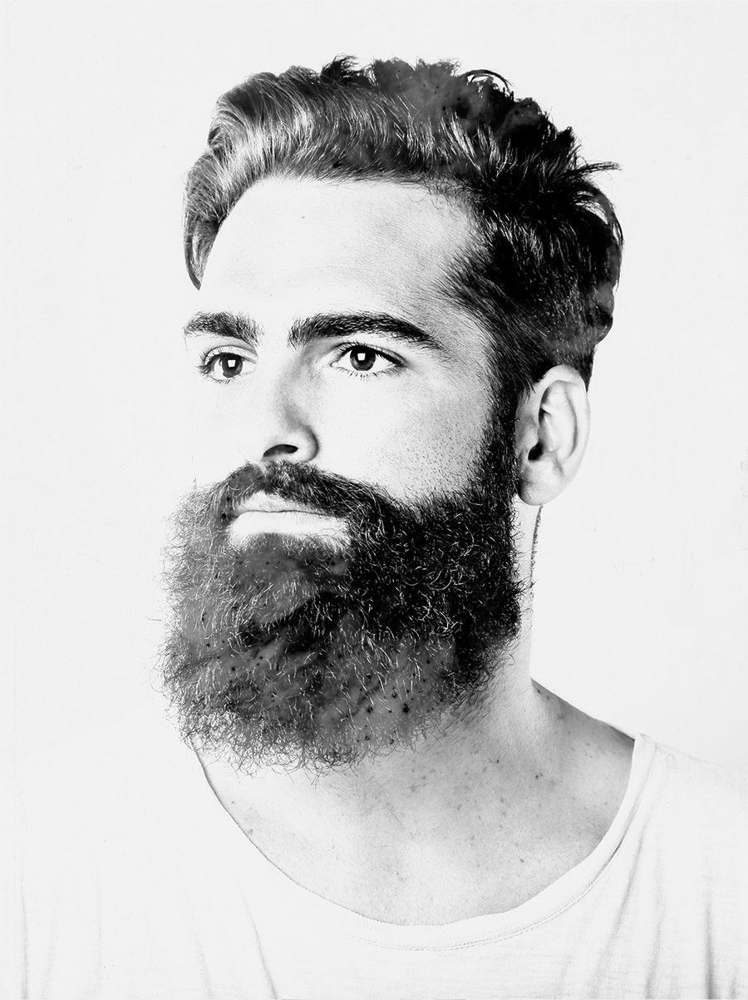

# Assignment 26 (opencv library)
## 1 Make a chess board with for loop using OpenCV.

## 2 Invert dark and light colors fot these images.
### inputs

### outputs

## 3 These two men are sad😔. Rotate the image 180 degrees to make them happy😊.
### inputs

### outputs

## 4 Design the first character of your name.

## 5 Generate a gradient.

## 6 Add a black tape (death symbol) to an image.
### inputs

### outputs
